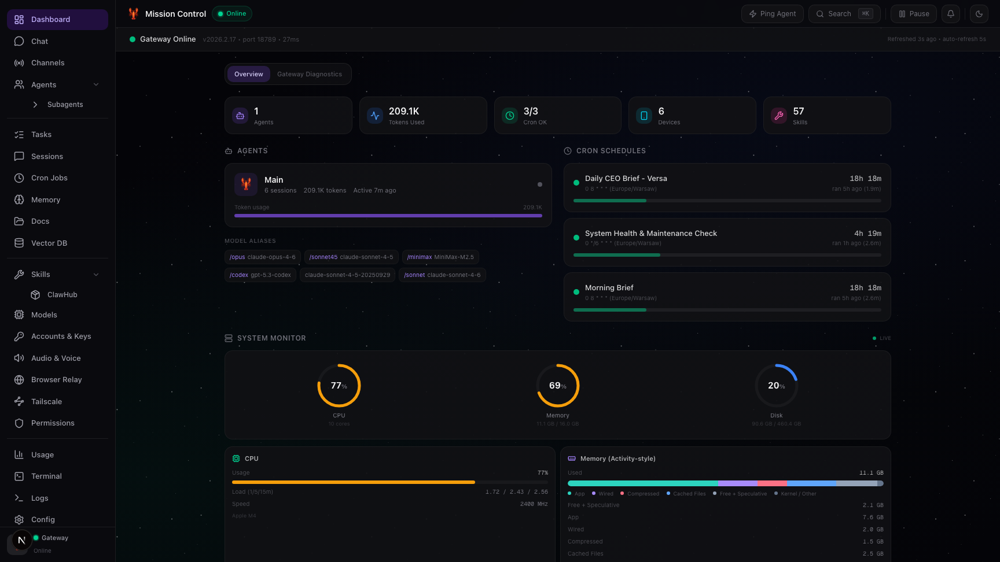
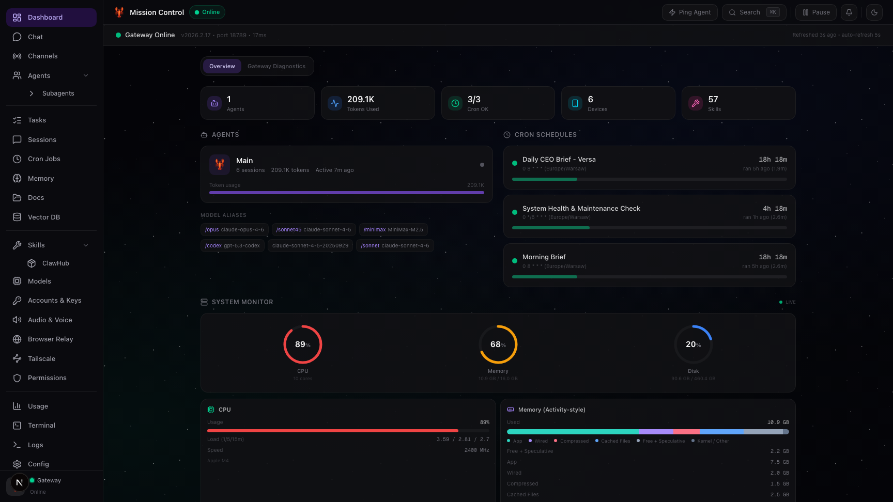
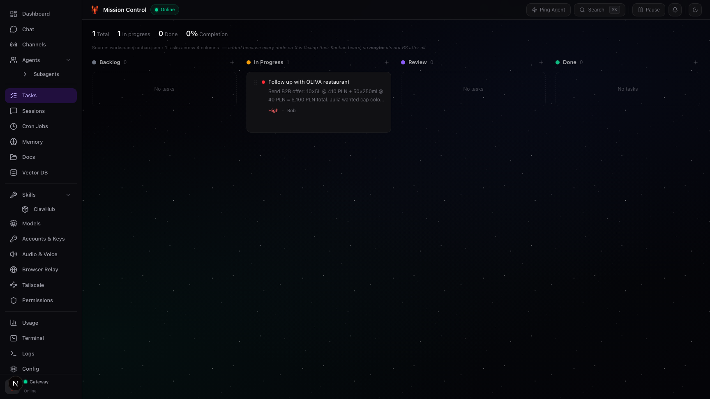
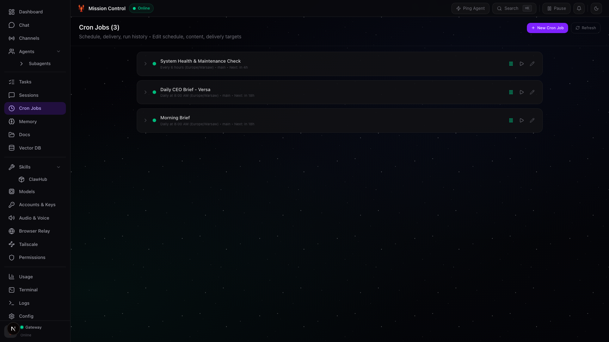
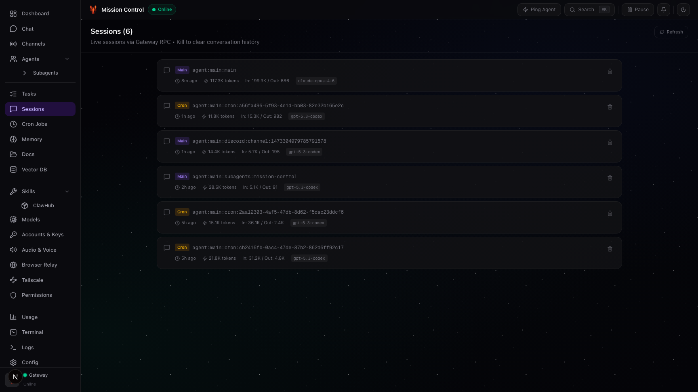
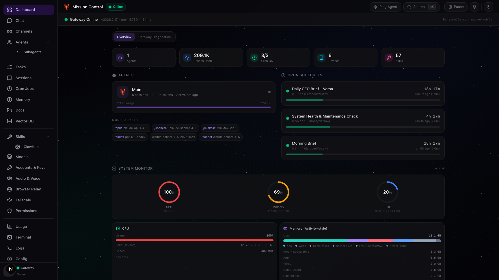
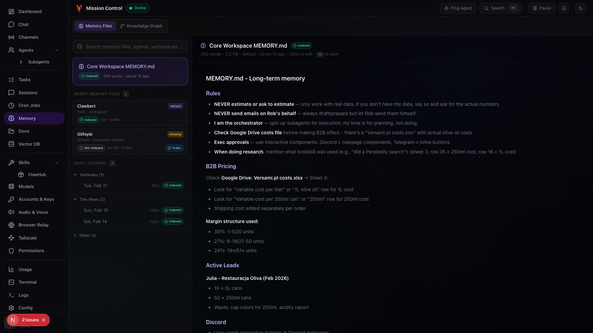
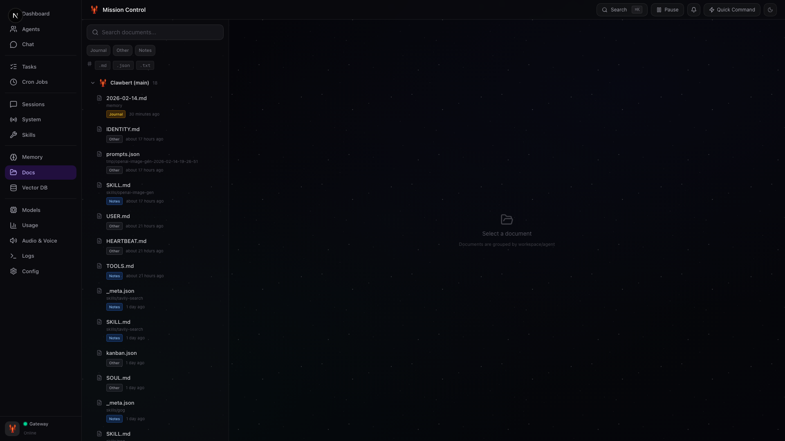

# Mission Control — OpenClaw GUI

**The open-source AI agent dashboard and local AI management tool for [OpenClaw](https://github.com/openclaw).**

**开源 AI 智能体仪表盘，专为 [OpenClaw](https://github.com/openclaw) 打造的本地 AI 管理工具。**

Monitor, chat with, and manage your AI agents, models, cron jobs, vector memory, and skills — all from a single self-hosted dashboard that runs entirely on your machine. No cloud. No data leaves your computer.

监控、对话并管理你的 AI 智能体、模型、定时任务、向量记忆和技能 —— 一切都在你电脑上本地运行的自托管仪表盘中完成。无需云端，数据不会离开你的电脑。

[](https://github.com/openclaw)        

---

## Why Mission Control? / 为什么选择 Mission Control？

- **One GUI to rule them all** — Stop juggling CLI commands. The OpenClaw GUI gives you a visual interface for everything: agents, models, channels, memory, cron jobs, and more.
- **一个 GUI 掌控一切** —— 不再需要在命令行之间来回切换。OpenClaw GUI 为所有功能提供可视化界面：智能体、模型、通道、记忆、定时任务等。

- **Designed for everyone** — Whether you're an AI power-user or just getting started, this AI agent dashboard is built to be intuitive. Wizards, guided setup, and smart defaults mean zero friction.
- **为每个人设计** —— 无论你是 AI 高级用户还是初学者，这个 AI 智能体仪表盘都力求直观易用。向导、引导设置和智能默认值意味着零摩擦。

- **100% local & private** — This self-hosted AI dashboard never phones home. Your data, your models, your machine. Period.
- **100% 本地且隐私** —— 这个自托管 AI 仪表盘从不回传数据。你的数据、你的模型、你的电脑。就这么简单。

- **Real-time monitoring** — Live CPU/memory stats, agent status, model usage analytics, and cost tracking in one place.
- **实时监控** —— 实时 CPU/内存统计、智能体状态、模型使用分析和费用追踪，尽在一处。

---

## Quick Start / 快速开始

### Prerequisites / 前置要求

You need [OpenClaw](https://docs.openclaw.ai/install) installed first. If you don't have it:

你需要先安装 [OpenClaw](https://docs.openclaw.ai/install)。如果还没有安装：

```bash
curl -fsSL https://openclaw.ai/install.sh | bash
```

Verify it's working / 验证安装是否成功：

```bash
openclaw --version
```

### Install the Dashboard / 安装仪表盘

Clone this repo **anywhere** (it auto-discovers your OpenClaw installation):

将此仓库克隆到**任意位置**（它会自动发现你的 OpenClaw 安装）：

```bash
git clone https://github.com/robsannaa/openclaw-mission-control.git
cd openclaw-mission-control
npm install
npm run dev
```

Open `http://localhost:3000` — done! / 打开 `http://localhost:3000` —— 完成！

> **Zero config needed.** The dashboard automatically finds your `~/.openclaw` directory and the `openclaw` binary.
>
> **无需任何配置。** 仪表盘会自动找到你的 `~/.openclaw` 目录和 `openclaw` 二进制文件。

---

## What is Mission Control? / Mission Control 是什么？

Mission Control is the **OpenClaw GUI** — a full-featured **AI agent dashboard** and **local AI management tool** that sits on top of [OpenClaw](https://github.com/openclaw). Think of it as the cockpit for your entire AI agent system: manage models, monitor performance, schedule tasks, search vector memory, and chat with your agents — all through one interface.

Mission Control 是 **OpenClaw 的图形界面 (GUI)** —— 一个功能完整的 **AI 智能体仪表盘**和**本地 AI 管理工具**，基于 [OpenClaw](https://github.com/openclaw) 构建。你可以把它想象成整个 AI 智能体系统的驾驶舱：管理模型、监控性能、调度任务、搜索向量记忆，以及与智能体对话 —— 全部通过一个界面完成。

| Feature / 功能 | Description / 说明 |
|---|---|
| **Dashboard / 仪表盘** | See everything at a glance: gateway status, active agents, cron jobs, and live system stats / 一目了然：网关状态、活跃智能体、定时任务和实时系统指标 |
| **Agents / 智能体** | Visualize your agent hierarchy, models, channels, and workspaces / 可视化智能体层级、模型、通道和工作空间 |
| **Chat / 对话** | Talk to your OpenClaw agents directly from the browser / 直接在浏览器中与 OpenClaw 智能体对话 |
| **Tasks / 任务** | Built-in Kanban board that syncs with your workspace / 内置看板，与工作空间同步 |
| **Memory / 记忆** | Edit your agent's long-term memory and daily journal / 编辑智能体的长期记忆和每日日志 |
| **Cron Jobs / 定时任务** | View, create, edit, enable/disable, and trigger scheduled tasks / 查看、创建、编辑、启停和触发定时任务 |
| **Usage / 用量统计** | Deep analytics on model usage, tokens, sessions, and costs / 深入分析模型使用、Token 消耗、会话和费用 |
| **Models / 模型管理** | Manage primary/fallback models with drag-and-drop reordering / 通过拖拽管理主模型和备用模型 |
| **Vector Memory / 向量记忆** | Browse and search your semantic memory (like Pinecone, but local) / 浏览和搜索语义记忆（类似 Pinecone，但完全本地） |
| **Terminal / 终端** | Built-in terminal to run any command directly in the dashboard / 内置终端，直接在仪表盘中运行任何命令 |
| **System / 系统** | Real-time CPU, memory, disk, skills, devices, and config management / 实时 CPU、内存、磁盘、技能、设备和配置管理 |
| **Documents / 文档** | Browse workspace docs across all agents / 浏览所有智能体的工作空间文档 |
| **Search / 搜索** | `Cmd+K` semantic search powered by OpenClaw's vector DB / `Cmd+K` 语义搜索，由 OpenClaw 的向量数据库驱动 |

Everything runs locally — Mission Control is a **self-hosted AI dashboard**. No cloud services, no telemetry, no data ever leaves your machine.

一切都在本地运行 —— Mission Control 是一个**自托管 AI 仪表盘**。没有云服务，没有遥测，数据永远不会离开你的电脑。

---

## Screenshots / 截图

### Dashboard / 仪表盘

*Real-time overview of your agents, gateway status, and system metrics*

*实时概览你的智能体、网关状态和系统指标*

### Tasks / 任务看板

*Kanban board synchronized with your workspace*

*与工作空间同步的看板*

### Cron Jobs / 定时任务

*Manage and monitor scheduled tasks*

*管理和监控定时任务*

### Sessions / 会话

*Chat history and agent interactions*

*对话历史和智能体交互记录*

### System / 系统

*CPU, memory, skills, and device management*

*CPU、内存、技能和设备管理*

### Memory / 记忆

*Edit long-term memory and daily journal*

*编辑长期记忆和每日日志*

### Documents / 文档

*Browse workspace documentation*

*浏览工作空间文档*

---

## Let OpenClaw Install It For You / 让 OpenClaw 帮你安装

Already have OpenClaw running? Just ask your agent:

已经在运行 OpenClaw？直接让你的智能体帮你安装：

```
Hey, install Mission Control for me — here's the repo: https://github.com/robsannaa/openclaw-mission-control
```

Your agent will / 你的智能体会：
1. Clone this repo to your workspace / 克隆仓库到你的工作空间
2. Run `npm install` / 运行 `npm install`
3. Start the dev server / 启动开发服务器
4. Open it in your browser / 在浏览器中打开

---

## How It Works / 工作原理

This local AI management tool **auto-discovers** your OpenClaw installation at startup. No configuration needed — the OpenClaw GUI connects to your agent system instantly.

这个本地 AI 管理工具在启动时**自动发现**你的 OpenClaw 安装，无需任何配置 —— OpenClaw GUI 会立即连接到你的智能体系统。

**What it finds automatically / 自动发现的内容：**

1. **OpenClaw binary / 二进制文件** — checks `which openclaw`, then common paths like `/opt/homebrew/bin/openclaw` / 检查 `which openclaw`，然后搜索常见路径
2. **Home directory / 主目录** — looks at `~/.openclaw` (or `OPENCLAW_HOME` env var if set) / 查找 `~/.openclaw`（或 `OPENCLAW_HOME` 环境变量）
3. **Agents / 智能体** — reads `openclaw.json` and scans agent directories / 读取 `openclaw.json` 并扫描智能体目录
4. **Workspaces / 工作空间** — discovers all workspace directories from your config / 从配置中发现所有工作空间目录

**You can clone this repo anywhere.** It doesn't need to be inside `~/.openclaw` or any specific location.

**你可以把仓库克隆到任何地方。** 不需要放在 `~/.openclaw` 或任何特定位置。

---

## Troubleshooting / 故障排除

### "OpenClaw not found" / 找不到 OpenClaw

The dashboard couldn't find the `openclaw` binary. Make sure it's installed and in your PATH:

仪表盘找不到 `openclaw` 二进制文件。确保已安装并在 PATH 中：

```bash
openclaw --version
```

If that works but the dashboard still complains, set the path explicitly:

如果命令正常但仪表盘仍然报错，请手动指定路径：

```bash
OPENCLAW_BIN=$(which openclaw) npm run dev
```

### Port 3000 already in use / 端口 3000 被占用

Change the port / 更换端口：

```bash
npm run dev -- --port 8080
```

---

## Environment Variables (optional) / 环境变量（可选）

Everything auto-discovers, but you can override if needed:

一切都会自动发现，但你也可以手动覆盖：

| Variable / 变量 | Default / 默认值 | Description / 说明 |
|---|---|---|
| `OPENCLAW_HOME` | `~/.openclaw` | Path to your OpenClaw home directory / OpenClaw 主目录路径 |
| `OPENCLAW_BIN` | Auto-detected / 自动检测 | Path to the `openclaw` binary / `openclaw` 二进制文件路径 |
| `OPENCLAW_WORKSPACE` | Auto-detected / 自动检测 | Path to the default workspace / 默认工作空间路径 |
| `OPENCLAW_SKILLS_DIR` | Auto-detected / 自动检测 | Path to system skills directory / 系统技能目录路径 |


## Project Structure / 项目结构

```
dashboard/
├── src/
│   ├── app/
│   │   ├── api/             # Backend API routes / 后端 API 路由
│   │   ├── page.tsx         # Main app shell / 主应用外壳
│   │   └── layout.tsx       # Root layout + theme / 根布局和主题
│   ├── components/          # UI components / UI 组件
│   ├── hooks/               # React hooks / React 钩子
│   └── lib/
│       ├── paths.ts         # Self-discovery logic / 自动发现逻辑
│       └── openclaw-cli.ts  # CLI & gateway wrapper / CLI 和网关封装
├── public/                  # PWA manifest & service worker / PWA 清单和 Service Worker
├── package.json
└── next.config.ts
```

---

## FAQ / 常见问题

<details>
<summary><strong>"command not found: openclaw" — what do I do? / 找不到命令怎么办？</strong></summary>

Make sure OpenClaw is installed and the `openclaw` binary is in your PATH:

确保已安装 OpenClaw 并且 `openclaw` 在你的 PATH 中：

```bash
openclaw --version
```

If that doesn't work, [install OpenClaw first](https://docs.openclaw.ai/install).

如果不行，请先 [安装 OpenClaw](https://docs.openclaw.ai/install)。
</details>

<details>
<summary><strong>Can I run this on a remote server? / 可以在远程服务器上运行吗？</strong></summary>

Yes! Clone it on any machine where OpenClaw is installed:

可以！在任何安装了 OpenClaw 的机器上克隆：

```bash
git clone https://github.com/robsannaa/openclaw-mission-control.git
cd openclaw-mission-control
npm install
npm run dev -- --port 8080
```

For remote access via SSH / 通过 SSH 远程访问：

```bash
ssh -N -L 3000:127.0.0.1:3000 user@your-server
```
</details>

<details>
<summary><strong>Does this send my data anywhere? / 会把数据发送到任何地方吗？</strong></summary>

No. Everything runs locally. Mission Control talks to your local OpenClaw installation through the CLI and gateway RPC. No data leaves your computer.

不会。一切都在本地运行。Mission Control 通过 CLI 和网关 RPC 与本地的 OpenClaw 通信。数据不会离开你的电脑。
</details>

<details>
<summary><strong>Can I use this with multiple OpenClaw instances? / 可以同时使用多个 OpenClaw 实例吗？</strong></summary>

Yes — set `OPENCLAW_HOME` to point at a different instance:

可以 —— 设置 `OPENCLAW_HOME` 指向不同的实例：

```bash
OPENCLAW_HOME=/path/to/other/.openclaw npm run dev -- --port 3001
```
</details>

---

## Tech Stack / 技术栈

| Layer / 层 | Tech / 技术 |
|---|---|
| Framework / 框架 | [Next.js 16](https://nextjs.org) |
| UI / 界面 | [React 19](https://react.dev), [Tailwind CSS 4](https://tailwindcss.com), [shadcn/ui](https://ui.shadcn.com), [Radix UI](https://radix-ui.com) |
| AI / 人工智能 | [Vercel AI SDK](https://sdk.vercel.ai) |
| Icons / 图标 | [Lucide](https://lucide.dev) |
| Markdown | [react-markdown](https://github.com/remarkjs/react-markdown) |
| Testing / 测试 | [Playwright](https://playwright.dev) |

---

## Contributing / 贡献

Pull requests are welcome! If you find a bug or have a feature idea, [open an issue](https://github.com/openclaw/dashboard/issues).

欢迎提交 Pull Request！如果你发现了 Bug 或有新功能想法，请 [提交 Issue](https://github.com/openclaw/dashboard/issues)。

---

## License / 许可证

MIT
