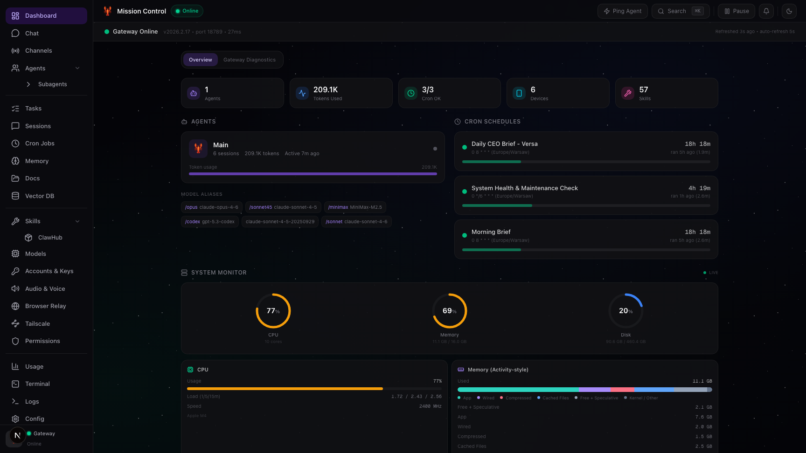

# Mission Control — OpenClaw GUI

**The open-source AI agent dashboard and local AI management tool for [OpenClaw](https://github.com/openclaw).**

Monitor, chat with, and manage your AI agents, models, cron jobs, vector memory, and skills — all from a single self-hosted dashboard that runs entirely on your machine. No cloud. No data leaves your computer.

---

## Why Mission Control?

- **One GUI to rule them all** — Stop juggling CLI commands. The OpenClaw GUI gives you a visual interface for everything: agents, models, channels, memory, cron jobs, and more.

- **Designed for everyone** — Whether you're an AI power-user or just getting started, this AI agent dashboard is built to be intuitive. Wizards, guided setup, and smart defaults mean zero friction.

- **100% local & private** — This self-hosted AI dashboard never phones home. Your data, your models, your machine. Period.

- **Real-time monitoring** — Live CPU/memory stats, agent status, model usage analytics, and cost tracking in one place.

---

## Quick Start

### Prerequisites

You need [OpenClaw](https://docs.openclaw.ai/install) installed first. If you don't have it:

```bash
curl -fsSL https://openclaw.ai/install.sh | bash
```

Verify it's working:

```bash
openclaw --version
```

### Install the Dashboard

Clone this repo inside your OpenClaw home folder (recommended: `~/.openclaw`):

```bash
cd ~/.openclaw
git clone https://github.com/robsannaa/openclaw-mission-control.git
cd openclaw-mission-control
./setup.sh
```

`setup.sh` installs dependencies, builds the app, and starts it as a background service.
Use `PORT=3333 ./setup.sh` to change port, or `./setup.sh --dev --no-service` for local dev mode.

Remote access example:

```bash
ssh -N -L 3333:127.0.0.1:3333 user@your-server
```

Manual mode (no setup script):

```bash
npm install
npm run dev
```

Open `http://localhost:3333` (setup script) or `http://localhost:3000` (manual dev) — done!

> **Zero config needed.** The dashboard automatically finds your `~/.openclaw` directory and the `openclaw` binary.

---

## What is Mission Control?

Mission Control is the **OpenClaw GUI** — a full-featured **AI agent dashboard** and **local AI management tool** that sits on top of [OpenClaw](https://github.com/openclaw). Think of it as the cockpit for your entire AI agent system: manage models, monitor performance, schedule tasks, search vector memory, and chat with your agents — all through one interface.

| Feature                          | Description                                                                                                                                    |
| -------------------------------- | ---------------------------------------------------------------------------------------------------------------------------------------------- |
| **Dashboard**                    | See everything at a glance: gateway status, active agents, cron jobs, live system stats, and deep links from recent cron results to job editor |
| **Agents Org Chart**             | Visualize hierarchy, live runtime subagents, channels, and workspaces with click-through modals (workspace files + open in Docs)               |
| **Subagents Mission Control**    | Spawn/list/kill subagents, run `/subagents` commands, and use direct `agent-send` task dispatch                                                |
| **Chat**                         | Talk to your OpenClaw agents directly from the browser                                                                                         |
| **Tasks**                        | Built-in Kanban board that syncs with your workspace                                                                                           |
| **Memory**                       | Edit your agent's long-term memory and daily journal                                                                                           |
| **Cron Jobs**                    | View, create, edit, enable/disable, and trigger scheduled tasks                                                                                |
| **Models**                       | Unified model runtime/config controls, provider auth, env-backed model keys, and auth profile stores                                           |
| **Accounts & Keys**              | Channel/integration credentials, env key editing, and auto-discovered external credentials (non-model secrets)                                 |
| **Browser Relay**                | Inspect extension relay state, connection status, profiles, and debug quickly                                                                  |
| **Tailscale Control**            | Manage serve/exposure status, tunnel state, and on/off actions from GUI                                                                        |
| **Gateway Source-of-Truth Sync** | UI state is driven by gateway/session truth with loading skeletons to avoid false default flicker                                              |
| **Usage**                        | Deep analytics on model usage, tokens, sessions, and costs                                                                                     |
| **Vector Memory**                | Browse and search your semantic memory (like Pinecone, but local)                                                                              |
| **Terminal**                     | Built-in terminal to run any command directly in the dashboard                                                                                 |
| **Gateway Diagnostics**          | Live doctor/status checks with actionable alerts and remediation hints                                                                         |
| **Documents**                    | Browse workspace docs across all agents                                                                                                        |
| **Search**                       | `Cmd+K` semantic search powered by OpenClaw's vector DB                                                                                        |

Everything runs locally — Mission Control is a **self-hosted AI dashboard**. No cloud services, no telemetry, no data ever leaves your machine.

### Power-user workflows

1. **Workspace node inspector**: Click a workspace node in Agents Org Chart to open a file-list modal, then jump directly to Docs for detailed edit flow.
2. **Subagent command center**: Spawn with task payloads, run direct commands, list active sessions only, and kill quickly from one panel.
3. **Credential control**: Vercel-style double-input secret editing, reveal/hide toggles, and auto-discovered integration/skill credentials.
4. **Tailscale control plane**: View configured exposure mode + live tunnel active/inactive state, then toggle and run runtime actions without leaving UI.

---

## Screenshots

### Dashboard

_Real-time overview of your agents, gateway status, and system metrics_

### Agents Org Chart

_Interactive hierarchy view with channels, workspaces, and runtime context_

### Subagents Mission Control

_Spawn/list/kill subagents and run control commands from one place_

### Cron Jobs

_Manage and monitor scheduled tasks_

### Models

_Unified model runtime/config controls plus provider auth inventory_

### Accounts & Keys

_Integration credentials, env key editing, and discovered secret sources_

### Tailscale

_Integrated Tailscale status, exposure controls, and tunnel actions_

### Browser Relay

_Debug extension relay connectivity and runtime health instantly_

### Tasks

_Kanban board synchronized with your workspace_

### Sessions

_Chat history and agent interactions_

### Gateway Diagnostics

_Doctor/status checks, config/runtime drift visibility, and recovery actions_

### Memory

_Edit long-term memory and daily journal_

### Documents

_Browse workspace documentation_

---

## Let OpenClaw Install It For You

Already have OpenClaw running? Just ask your agent:

```
Hey, install Mission Control for me — here's the repo: https://github.com/robsannaa/openclaw-mission-control
```

Your agent will:

1. Clone this repo to your workspace
2. Run `npm install`
3. Start the dev server
4. Open it in your browser

---

## How It Works

This local AI management tool **auto-discovers** your OpenClaw installation at startup. No configuration needed — the OpenClaw GUI connects to your agent system instantly.

**What it finds automatically:**

1. **OpenClaw binary** — checks `which openclaw`, then common paths like `/opt/homebrew/bin/openclaw`
2. **Home directory** — looks at `~/.openclaw` (or `OPENCLAW_HOME` env var if set)
3. **Agents** — reads `openclaw.json` and scans agent directories
4. **Workspaces** — discovers all workspace directories from your config

**Recommended clone location: `~/.openclaw`.** This keeps paths and tooling behavior predictable and avoids accidental multi-install confusion.

---

## Troubleshooting

### "OpenClaw not found"

The dashboard couldn't find the `openclaw` binary. Make sure it's installed and in your PATH:

```bash
openclaw --version
```

If that works but the dashboard still complains, set the path explicitly:

```bash
OPENCLAW_BIN=$(which openclaw) npm run dev
```

### Port 3000 already in use

Change the port:

```bash
npm run dev -- --port 8080
```

---

## Environment Variables (optional)

Everything auto-discovers, but you can override if needed:

| Variable              | Default       | Description                          |
| --------------------- | ------------- | ------------------------------------ |
| `OPENCLAW_HOME`       | `~/.openclaw` | Path to your OpenClaw home directory |
| `OPENCLAW_BIN`        | Auto-detected | Path to the `openclaw` binary        |
| `OPENCLAW_WORKSPACE`  | Auto-detected | Path to the default workspace        |
| `OPENCLAW_SKILLS_DIR` | Auto-detected | Path to system skills directory      |

## Project Structure

```
dashboard/
├── src/
│   ├── app/
│   │   ├── api/             # Backend API routes
│   │   ├── page.tsx         # Main app shell
│   │   └── layout.tsx       # Root layout + theme
│   ├── components/          # UI components
│   ├── hooks/               # React hooks
│   └── lib/
│       ├── paths.ts         # Self-discovery logic
│       └── openclaw-cli.ts  # CLI & gateway wrapper
├── public/                  # PWA manifest & service worker
├── package.json
└── next.config.ts
```

---

## FAQ

<details>
<summary><strong>"command not found: openclaw" — what do I do?</strong></summary>

Make sure OpenClaw is installed and the `openclaw` binary is in your PATH:

```bash
openclaw --version
```

If that doesn't work, [install OpenClaw first](https://docs.openclaw.ai/install).

</details>

<details>
<summary><strong>Can I run this on a remote server?</strong></summary>

Yes! On the remote machine, clone it inside that machine's `~/.openclaw`:

```bash
cd ~/.openclaw
git clone https://github.com/robsannaa/openclaw-mission-control.git
cd openclaw-mission-control
npm install
npm run dev -- --port 8080
```

For remote access via SSH:

```bash
ssh -N -L 3000:127.0.0.1:3000 user@your-server
```

</details>

<details>
<summary><strong>Does this send my data anywhere?</strong></summary>

No. Everything runs locally. Mission Control talks to your local OpenClaw installation through the CLI and gateway RPC. No data leaves your computer.

</details>

<details>
<summary><strong>Can I use this with multiple OpenClaw instances?</strong></summary>

Yes — set `OPENCLAW_HOME` to point at a different instance:

```bash
OPENCLAW_HOME=/path/to/other/.openclaw npm run dev -- --port 3001
```

</details>

---

## Tech Stack

| Layer     | Tech                                                                                                                                           |
| --------- | ---------------------------------------------------------------------------------------------------------------------------------------------- |
| Framework | [Next.js 16](https://nextjs.org)                                                                                                               |
| UI        | [React 19](https://react.dev), [Tailwind CSS 4](https://tailwindcss.com), [shadcn/ui](https://ui.shadcn.com), [Radix UI](https://radix-ui.com) |
| AI        | [Vercel AI SDK](https://sdk.vercel.ai)                                                                                                         |
| Icons     | [Lucide](https://lucide.dev)                                                                                                                   |
| Markdown  | [react-markdown](https://github.com/remarkjs/react-markdown)                                                                                   |
| Testing   | [Playwright](https://playwright.dev)                                                                                                           |

---

## Releasing

Releases are created automatically when you push a version tag. After pushing your code:

```bash
git tag v0.1.0   # use the version you're releasing (e.g. match package.json)
git push origin v0.1.0
```

The [Release workflow](.github/workflows/release.yml) creates a GitHub Release with auto-generated notes. Bump `version` in `package.json` before tagging if you want the tag to match.

---

## Contributing

Pull requests are welcome! If you find a bug or have a feature idea, [open an issue](https://github.com/openclaw/dashboard/issues).

---

## License

MIT
